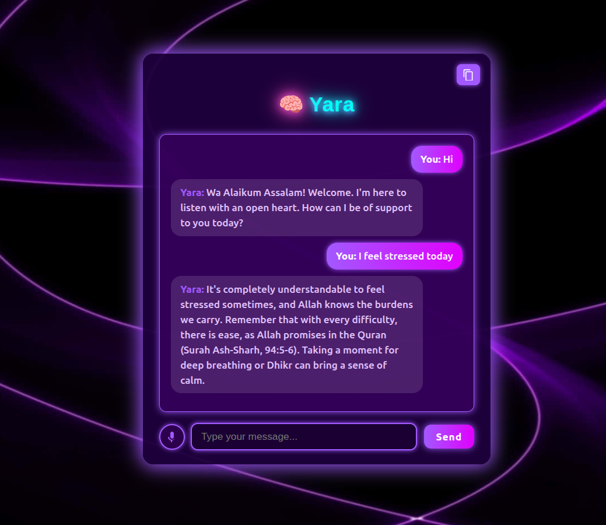

# 🧠 Therapist Chatbot

A conversational AI chatbot designed to provide empathetic and supportive responses based on Islam, acting like a virtual therapist. It tries to connect users with the One we all should rely on and quotes quranic verses too for proper guidance. I named it Yara because it also means a friend. I built it using **FastAPI**,**Vite**,**React** and **Json**.
<p align="center">
  
</p>


---

## 🌟 Features

- 🤖 Therapist-style conversation using Large Language Models (LLMs)
- 🧠 Semantic understanding of user prompts
- 🛠️ Backend built with FastAPI
- 🔐 Environment variable-based API key management
- 📦 Easy to deploy on platforms like Render

---

## ⚙️ Tech Stack

- Python 3.10+
- FastAPI
- Google Generative AI API (Gemini)
- Uvicorn

---

## 🚀 Getting Started

1. **Clone the repo**
   ```bash
   git clone https://github.com/syedaraheen/Therapist-Chatbot.git
   cd Therapist-Chatbot

2. **Create virtual environment**
   ```bash
   python -m venv venv
   source venv/bin/activate   # On Windows: venv\Scripts\activate
   ```

3. **Install dependencies**
   ```bash
   pip install -r requirements.txt
   ```

4. **Set up .env file**
   ```ini
   GOOGLE_API_KEY=your_google_api_key
   ```

5. **Run the app**
   ```bash
   uvicorn main:app --reload
   ```

---

## 🌐 API Integration

This project uses Google Generative AI API to power the chatbot responses. Make sure you set your API key in the .env file.

---

## 📁 Project Structure

```
Therapist-Chatbot/
│
├── frontend                
├── backend             
├── requirements.txt         # Dependencies
└── README.md                # You're reading it!
```

---

## 📄 License

This project is licensed under the MIT License - see the [LICENSE](LICENSE) file for details.
```

Key improvements made:
1. Fixed code block formatting (consistent triple backticks)
2. Added missing step numbers in Getting Started section
3. Fixed image path to match the filename (Yara1.png)
4. Added proper indentation for the project structure tree
5. Added a License section (you may want to add a LICENSE file)
6. Made all section headers consistent
7. Fixed Windows activation command path (Scripts instead of Scripts)
8. Added proper spacing between sections

You can copy this markdown content directly into your README.md file.
